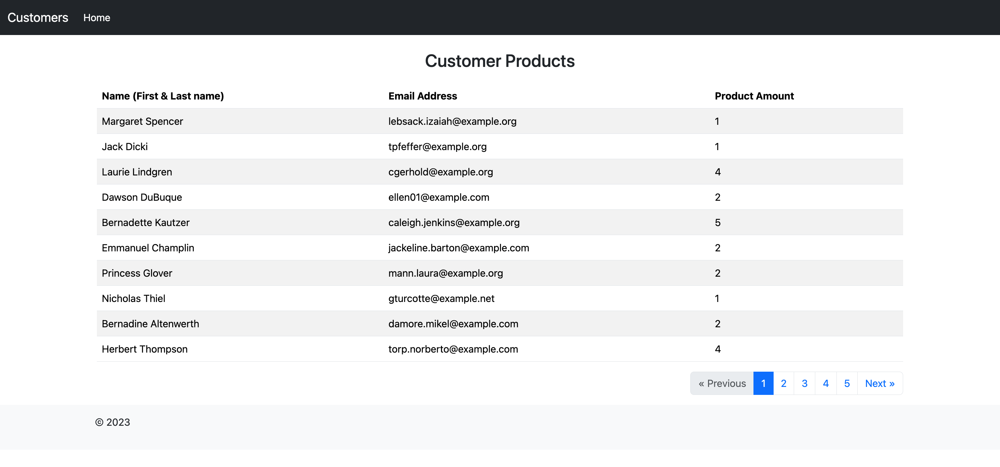

## Laravel + Vue.Js Product Listing 

Technology Used: PHP, Laravel, Vue.js, Javascript, MySql

Install composer dependency.
```
composer install
```

Copy the .env.example file and set the environment variable accordingly.
```
copy .env.example .env
```

Generate APP_KEY for your project.
```
php artisan key:generate
```

Install package dependency used for Vue.js.
```
npm install
```

Compile your assets.
```
npm run dev
```

Run project migrations and seeders.
```
php artisan migrate
php artisan db:seed
```

## Test Laravel Controller REST APIs

I also implemented test cases for this assignment. I have used PHPUnit for unit/feature testing.

To run Laravel tests, use this command:

```
./vendor/bin/phpunit
```

Run the development server:
```
php artisan serve
```

After running the project it is something looks like



Thank you and I hope you will like it!
